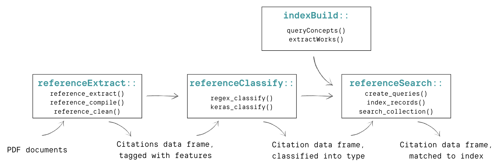

```{r chunk setup, include = F}
knitr::opts_chunk$set(warning = F, message = F)
```

```{r functions, echo= F,message = F}
library(showtext)
#font_add_google("Roboto mono")
theme_govuser <- function(base_size = 12, font = "mono") {
  theme_minimal(base_size = base_size) +
  theme(text = element_text(colour = "black", 
                            family = font),
       panel.grid = element_line(colour = "#d9d9d9")
      )
}
```

### Introduction  

Aligning scientific supply with policy demand in order to develop evidence-based policy is considered a gold standard by many accounts. The Biden Administration recently reaffirmed that 'It is the policy of [the Biden] Administration to make evidence-based decisions guided by the best available science and data... Scientific findings should never be distorted or influenced by political considerations' (Biden, 2021). This sentiment has been echoed by the calls for use-inspired basic research to deliver innovative solutions in service of social and environmental goals (Stokes 2011; Fuglie & Toole 2014). 

However, there is broad recognition that promoting evidence-based policymaking at face value overlooks challenges related to knowledge politics and the selective use of science. Namely, policymakers' emphasis on science as a neutral arbiter masks the politics of generating and communicating scientific knowledge (Sarewitz 2000). Science is not value-free, but rather, supply and demand of science are politically linked (Sarewitz & Pielke 2007). As such, research to support evidence-based policymaking requires intentional engagement by scientists to not only reduce uncertainty through high-quality research, but also reduce ambiguity through strategic communication and problem framing (Cairney 2016). Emphasis on communication is echoed by literature on boundary spanners that can broker between the scientific and policy communities (Guston 2001).   

<!--- Qualitative case descriptions have described the recursive science-policy relationship for environmental issues such as acid rain, ozone repletion, and climate change (Pielke & Betsill 1997; Sarewitz 2000)--->

Recognizing the complex interplay of science and policymaking, what methods can we use to better understand these dynamics? Through surveys and interviews of public servants, studies find wide variation in how policymakers interact with scientific information (Newman et al. 2016), and highlight that internal governmental reports and personal networks are among the most popular sources of information (Piczak et al. 2022). These findings have been supported and detailed through a handful of bibliometric analyses of policy documents. Desmaris and Herd (2014) evaluated 102 Regulatory Impact Assessments, confirming that the majority of citations are to governmental agencies. They also describe the prevalence of disciplines like economics, environmental science, and public health from high-impact journals across 1,378 scholarly citations. Koontz (2022) finds similar trends when analyzing 12 salmon recovery plans, categorizing 1,104 references from various sources (academic, governmental, organizational, etc.) and expanding on how science is used to support causal arguments.  

The insights from bibliometric analyses of policy documents lay an important foundation for systematically quantifying the evidence used to support policy. However, manually extracting and indexing references can be a tedious task. Unlike 'science of science' research, where bibliometric methods are made easier through publishing norms of citations and indexing (e.g. DOIs, ORCIDs, etc.), science of policy research is less systematic. Policy documents do not always follow consistent formatting or citation norms, and references outside of non-scholarly articles (which are the majority of references) are not systematically indexed. However, developments in computational tools for reading and analyzing large texts create an opportunity for automating some of the more tedious phases of bibliometry on policy documents. This paper presents a set of tools for aiding bibliometric analysis of policy documents, `govscienceuseR`, which we hope will support policy process researchers in quantifying and unpacking the complex interplay of science and policymaking.  

### Method  

The `govscienceuseR` tools provide a computational approach for indexing and summarizing references from policy documents. This is a vignette walking through the steps of the R packages in the `govscienceuseR` tool set: `referenceExtract`, `referenceClassify`, `indexBuild`, and `referenceSearch`. Together, these four packages allow researchers to go from PDF documents to a data frame of indexed citations in only a handful of steps in the R coding language (steps mapped below). The goal of these tools is to allow researchers working with various types of policy documents to analyze citations using a systematic and reproducible approach.  


```{r workflow image, echo=FALSE, out.width='75%', fig.align = "center", eval = F}

```

### Case: Groundwater Sustainability Plans    

California's Sustainable Groundwater Management Act (SGMA) of 2014 sets out a framework for local Groundwater Sustainability Agencies ('Agencies') to work towards sustainable management of their groundwater basins. Agencies are required to outline their strategies in Groundwater Sustainability Plans (GSPs) -- documents reviewed by the Department of Water Resources (DWR) to ensure that Agency strategies comply with SGMA, the GSP regulations, and achieve groundwater sustainability for the basin (DWR no date). Among the criteria for plan evaluation, the California Code specifies: "When evaluating whether a Plan is likely to achieve the sustainability goal for the basin, the Department shall consider… Whether the assumptions, criteria, findings, and objectives, including the sustainability goal… are reasonable and supported by the best available information and best available science" (23 CCR § 355.4).  

There is a clear mandate that GSP documents use scientific evidence to support their strategies for groundwater sustainability, but defining and measuring sustainability is no simple feat (Kuhlman & Farrington 2010). DWR sets out six sustainability indicators, whereby the occurrence of any indicator would be an undesirable result: lowering groundwater levels, reduction of storage, seawater intrusion, degraded quality, land subsidence, and surface water depletion. However, each local Agency is responsible for setting measurable objectives and minimum thresholds for these indicators by considering all 'beneficial users and uses' for their basin (Austin, 2019). Beneficial uses include 'domestic, municipal, agricultural, and industrial supply; power generation; recreation; aesthetic enjoyment; navigation; and preservation and enhancement of fish, wildlife, and other aquatic resources or preserves' (California Water Plan glossary 2018). 

Facing the challenge of managing groundwater resources across a wide array of users and interests, we ask: **How is science used to inform the multiple dimensions of groundwater sustainability?** Analyses of the SGMA collaborative process and GSP drafts have already shown that achieving groundwater sustainability while supporting _all_ beneficial uses is unlikely. Minimum thresholds analyzed in draft plans found that some beneficial uses are preferenced over others, with stakeholders like domestic well users potentially going without water (Bostic et al. 2020). To build on this existing research, we turn to the scientific evidence used in GSPs to tell us about how agencies are defining sustainability. We trial the `govscienceuseR` tool kit on 114 GSPs, described more in the data section below.  

<!--- Representation challenges (Dobbin) --->

### Getting started   

#### Installations  

To begin, download all four packages from the [govscienceuseR GitHub page](https://github.com/govscienceuseR):  

```{r package download, warning = F, message = F, results = F, eval = F}
devtools::install_github("govscienceuseR/referenceExtract")
devtools::install_github("govscienceuseR/referenceClassify")
devtools::install_github("govscienceuseR/indexBuild")
devtools::install_github("govscienceuseR/referenceSearch")
```

```{r echo = F}
send_mailto <- 'tascott@ucdavis.edu'
```
Then load these and dependent packages into library. You may be prompted to install some of the dependent packages if you do not already have them, such as `keras`.  

<!---[**Note: All of the dependent packages required should be imported when we load in these packages, but they currently aren't -- still struggling with package imports when function-building**]. --->

```{r package setup, warning = F, message = F, results = F}
library(referenceExtract)
library(referenceClassify)
library(indexBuild)
library(referenceSearch)
packs <- c('data.table', 'dplyr', 'stringr', 'keras', 'tensorflow',
          'tidyr', 'purrr', 'sjrdata')
if(!'sjrdata' %in% installed.packages()[,'Package']){
  pak::pak('ikashnitsky/sjrdata')
}
sapply(packs, require, character.only = T)
```

Outside of R, the `referenceSearch` package also requires installation and running of  [Solr](https://solr.apache.org). This software should be downloaded to a known location on your computer.    

#### Data    

The documents of interest for this paper are California's Groundwater Sustainability Plans. These documents are available publicly to download from a [Box](https://ucdavis.box.com/s/9m3dogbibkrwy01pg4sdwouhzl8i6sef) folder we host. To follow along with this tutorial, download the files to a file that will be considered your document directory. Our document directory is specified below. Here we are working with `r length(list.files("~/Box/reference_classifier/documents_gsp/"))` plans which total over 160,000 pages, published between 2019-2022.  

```{r set doc dir}
doc_directory <- "~/Box/reference_classifier/reference_classifier/documents_gsp/"
```

```{r count pages, eval = F, echo = F}
pdfinfo <- lapply(list.files(doc_directory, full.names = T),
               pdftools::pdf_info)
yeardf <- data.frame()
for(i in 1:length(pdfinfo)){
  years <- year(pdfinfo[[i]]$created)
  yeardf <- rbind(years, yeardf)
}
summary(yeardf$X2020L[yeardf$X2020L != 2106])
pdfs <- data.frame(do.call('rbind', pdfinfo))
pages <- sum(as.numeric(pdfs$pages))
pages/nrow(pdfs)
```

### 1. `referenceExtract`  

The `referenceExtract` package from govscienceuseR is designed to take unstructured PDF documents, feed them through the [anystyle.io](https://anystyle.io/) citation extraction software, and return tagged citation data in a tabular format. This is accomplished using three functions, outlined in the following sections.     

#### `reference_extract()`   

The first step of extracting references is to input PDF documents into the `reference_extract()` function. This function reads in every PDF in the document directory (doc_dir), and runs them through anystyle.io. Anystyle extracts probable citations and exports them to the reference directory (ref_dir) as JSON files. Depending on the number and size of files, this can take some time. For example, these 114 documents took over an hour to extract.  

```{r set ref dir covert, echo = F}
ref_directory <- "posts/gsp_vignette_files/data/ref_dir"
```

```{r reference extract, eval = F}
# Extract probable citations from PDF documents and convert them to .json files
ref_directory <- "gsp_vignette_files/data/ref_dir"
reference_extract(doc_dir = doc_directory, 
                 ref_dir = ref_directory, 
                 layout = "none")
```

#### `reference_compile()`   

Next, the `reference_compile()` function transforms the JSON files into tabular data and compiles them all in one data table, adding the file name as an identifier.  

```{r reference compile}
# Compile json files into a singular tabular data table
dt <- reference_compile(ref_directory)
```

After these first two steps we can take a look at our probable citations according to the Anystyle software. Initially, there are `r nrow(dt)` probable citations across these `r length(list.files(ref_directory))` documents.  

```{r show compiled data, echo = F}
DT::datatable(head(select(dt, author, date, title, `container-title`),
                   n = 100), rownames = F)
```

It is noticeable above that the data provided by Anystyle has its challenges for further analysis. The first is a related to data structure: authors are nested into matrices, some rows (such as the date) have multiple listed values, etc., all of which make the data hard to analyze. For example, here is what seems to be two probable citations combined into one observation:  

<!--- Are these examples necessary? --->

```{r challenge example 1}
unnest(dt[204, c(2,3)])
```

The second challenge is related to quality: many of the probable citations are not sensible. The Anystyle software seems sensitive to multiple formats like numbers and short-form sentences, such as addresses, resulting in false positive identification of references. For example, here is an address listed as a probable citation from our data:  
```{r challenge example 2}
unlist(dt[148, c(1,3,5)])
```

#### `reference_clean()`  

To try to address the challenges in these probable citations, the `reference_clean()` function goes through a series of steps. For each column the function unlists the data and filters out unlikely candidates for that column. For instance, if a number listed in the date column does not match any reasonable date format or expectation, it is removed. If a string in the URL column actually resembles a DOI, it is moved to that column. And so on. Furthermore, if there seem to be multiple citations listed in one row that can be broken apart in parallel across all of the columns, we unnest these rows. (Note: depending on the size of the files this function may take some time. Cleaning these `r nrow(dt)` citations takes about 18 minutes).  

```{r reference clean, eval = F}
# Unnests list structures into tabular data and filters out low probability refs
dt <- reference_clean(dt)
```

```{r load ref clean dt covert, echo = F}
#saveRDS(cleaned_dt, "vignettes/gsp_vignette_files/data/dt_post_refclean.RDS")
dt <- readRDS("posts/gsp_vignette_files/data/dt_post_refclean.RDS")
```

This cleaning process has the changed probable citations now a bit. Some of the probable citations have been unnested (and therefore expanded) while others have been removed, leaving us with `r nrow(dt)` probable citations. Examples of these probable citations are below:   

```{r example of cleaned, echo = F}
DT::datatable(head(select(dt, author, year, title, container, publisher), n = 100), rownames = F)
```


### 2. `referenceClassify`  

The `referenceClassify` package is designed to take a data frame of tabular, tagged citation data (author, year, container, publisher, doi, etc), look for exact matches between those tags and various high-level indices (mainly journal and agency names), and begin to classify probable citations into these high-level categories. These indices are 1) an index of academic journals from the [`sjr` package](https://rdrr.io/github/ikashnitsky/sjrdata/man/sjr_journals.html) relying on the [Scimago database](https://www.scimagojr.com/), 2) an index of academic conference papers/proceedings also from the Scimago database, 3) and an index of US state and federal agencies, curated by the package authors. All three of these indices are built into this package and can be accessed with `data('scimago.j')` for journals, `data('scimago.c')` for conferences, and `data('agencies')` for agencies.  

<!---
#### `_match()` functions  

Based on our initial cleaning of the GSP data in the previous section, we can see which of these probable citations are exact matches to three different indices: an index of academic journals from the Scimago database, an index of academic conference papers/proceedings also from the Scimago database, and an index of US state and federal agencies, curated by the package authors. We can look for matches using the `journal_match()`, `conference_match()` and `agency_match()` functions.

```{r}
table(journal_match(dt$container))
```

```{r}
table(conference_match(dt$container))
```

```{r}
table(agency_match(dt$container, dt$author))
```
--->

#### `prepared_by()` and `journal_disambig()`  

<!--Note: Should these be moved to the cleaning function, or to the other package? --->

Before classifying our probable references, we can further clean and refine these potential citations with the `prepared_by()` function, which removes commonly-seen lead-ins to references ('prepared for/by', etc.) to improve exact matching.  

```{r prepared by}
dt <- prepared_by(dt, x = 'container', y = 'author', z = 'publisher')
```

Additionally, we disambiguate the journals with the `journal_disambig()` function, which references indices of common journal abbreviations and through manual cleaning of journals referenced in transportation documents.  

```{r journal disam}
dt$container <- journal_disambig(dt$container)
```

#### `regex_classify()`  

Now with probable references as 'clean' as possible, we use regular expressions to classify our data based on exact matches using the `regex_classify()` function. This function does two things. First it looks across all of the columns for exact matches to our indices, and if there is an exact match, it pulls out that value into a 'input' column. If there is no exact match, the value in the input column will be selected in the following order of preference: doi, container, publisher, title, author. Second, based on the matches the function will assign the potential citation into one of four classes: journal, agency, conference, or none. If none of the potential citations' data is an exact match to any of the indices, the classification is NA. 

```{r regex classify}
# Extract most descriptive 'input' and look for exact match to index 
dt <- regex_classify(dt, 'container')
```

<!--- So below I am pulling out the exact matches for agencies into their own column. Right now the function does not pull out the agency per se, it just tags whether or not it sees a match inside the columns specified in the function. So below I am doing it manually, but this should be built in --->

```{r exact match agencies, echo = F, eval = F}
data("agencies")
x = dt$training_input[dt$class == "agency" & !is.na(dt$class)]
abbr <- agencies$Abbr[agencies$Abbr != ""]
y = c(agencies$Agency, abbr)

dt_agencies <- filter(dt, class == "agency" & !is.na(class)) %>% 
  select(ID, training_input)
dt_agencies$agency = NA
t1 <- Sys.time()
for(i in 1:length(x)){
  for(j in 1:length(y)){
    match <- str_extract(x[i], y[j])
  if(!is.na(match)){
  dt_agencies$agency[i] <- match
  }
  }
    if(!is.na(match)){
      next
  }
}
t2 <- Sys.time()
t2-t1 

dt <- left_join(dt, dt_agencies)
dt$agency <- ifelse(dt$agency == "Geological Survey", 
                    "US Geological Survey", dt$agency)
dt$agency <- ifelse(dt$agency == "Army", 
                    "US Army", dt$agency)
dt$agency <- ifelse(dt$agency == "Army Corps of Engineers", 
                    "US Army Corps of Engineers", dt$agency)
dt$agency <- ifelse(dt$agency == "Bureau of Reclamation", 
                    "US Bureau of Reclamation", dt$agency)
dt$agency <- ifelse(dt$agency == "Census Bureau", 
                    "US Census Bureau", dt$agency)
dt$agency <- ifelse(dt$agency == "Department of Agriculture", 
                    "US Department of Agriculture", dt$agency)
dt$agency <- ifelse(dt$agency == "Department of Health and Human Services", 
                    "US Department of Health and Human Services", dt$agency)
dt$agency <- ifelse(dt$agency == "Department of the Interior", 
                    "US Department of the Interior", dt$agency)
dt$agency <- ifelse(dt$agency == "Environmental Protection Agency", 
                    "US Environmental Protection Agency", dt$agency)
dt$agency <- ifelse(dt$agency == "Fish and Wildlife Service", 
                    "US Fish and Wildlife Service", dt$agency)
dt$agency <- ifelse(dt$agency == "Forest Service", 
                    "US Forest Service", dt$agency)
saveRDS(dt, 'vignettes/gsp_vignette_files/data/dt_withagencies.rds')
```

```{r, echo = F}
dt <- readRDS('posts/gsp_vignette_files/data/dt_withagencies.rds')
```

Based on these classifications, we can see the counts of exact matches, and which ones have not been classified.   

```{r, echo = F, fig.align = 'center', results = 'asis'}
table <- data.frame("n" = c(table(dt$class), table(is.na(dt$class))[2]))
table$class <- c("Agency", "Conference", "Journal", "Not a citation", "Unclassified")
library(kableExtra)
kable(pivot_wider(table, names_from = class, 
                              values_from = n), booktabs = T, align = 'c') %>% 
  kable_styling()
```

#### `keras_classify()`  

Next we want to classify the probable references that are not exact matches to any of our indices. To do this, we use `keras_classify()`, in which we input our probable references into a neural network trained to predict the reference class. To train this model, we used data from Environmental Impact Statements, classified through both manual classification and the semi-automated regex classification explained above.  

```{r keras, eval = F}
# Use the descriptive 'input' to probabilistically identify the reference class
setwd("~/Documents/Davis/R-Projects/referenceClassify/")
predictions <- keras_classify(dt, probability = .85, 
                              'container', auto_input = F,
                              'training_input') 
dt <- cbind(dt, select(predictions, predict_class))
```

```{r load post keras dt covert, echo = F}
#saveRDS(dt, "vignettes/gsp_vignette_files/data/dt_post_keras.RDS")
dt <- readRDS("posts/gsp_vignette_files/data/dt_post_keras.RDS")
```

Because we ran this model on the whole data frame, we can compare our regex classification with the Keras classifications to get a sense of the model performance.  

```{r, echo = F, fig.align='center'}
dt <- dt %>% 
  mutate(class = case_when(
           class == "remove_row" ~ "delete",
           T ~ class),
         method = case_when(
           is.na(class) ~ "keras",
           T ~ "regex"),
         method_comparison = case_when(
           method == "regex" & class == predict_class ~ "match",
           method == "regex" & predict_class == "unsure" ~ "unsure",
           method == "regex" & class != predict_class ~ "incorrect",
           T ~ NA_character_))

table <- data.frame(table(dt$method_comparison)) %>% select(-Var1)
table$class <- c("Incorrect", "Match", "Classified as unsure")
kable(pivot_wider(table, names_from = class, 
                              values_from = Freq), booktabs = T, align = 'c') %>% 
  kable_styling()
```

These results, altogether, suggest that the Keras model is `r 100*round(table(dt$method_comparison)[[2]]/sum(table(dt$method_comparison)),2)`% accurate in its prediction of the citations we are able to do exact matching for. Now, let's unify the classification columns and have a look at the total for each estimated grouping.   

```{r, echo = F, fig.align='center'}
dt$class <- ifelse(is.na(dt$class), dt$predict_class, dt$class)
table <- data.frame(table(dt$class)) %>% select(-Var1)
table$class <- c("Agency", "Conference", "Not a citation",
                 "Journal", "Unsure")
kable(pivot_wider(table, names_from = class, values_from = Freq), 
                  booktabs = T, align = 'c')  %>% 
  kable_styling()
```

And we'll tidy up these data by filtering out the citations classified into 'delete' (the false positives) in preparation for our indexing in the next step.   
```{r}
dt <- dt %>% 
  select(-c(predict_class, method_comparison)) %>% 
  filter(class != "delete")
```

#### Interim check in: Journals and agencies from exact matching   

So far, we've identified exact matches to our high-level indices (journal, agency, conference) and then used machine learning to classify citations that are not exact matches so that we can begin to figure out their source. At this interim stage, we can take a look at the high-level classifications across citations, and the journals and agencies for which we've found exact matches.  

First, let's take a look at the high-level matches. A reference list was required by DWR for GSPs, and indeed we see that all `r length(unique(dt$File[dt$class %in% c("journal", "agency")]))` of the documents have references that we can identify as either a scholarly journal or agency. Based on our tool's probabilistic tags, it looks like the number of references ranges from 1 to 128, with 24 being the average number of classified references. That average differs between references classes, whereby the average number of journal references is 16 and the average number of agency references is twice that, at 32. In total, there are 1,865 journal references and 3,675 agency references.  

```{r summaries of references, echo = F, results = F}
by_doc <- dt %>% 
  filter(class %in% c("journal", "agency")) %>% 
  group_by(File, class) %>% 
  count() %>% 
  ungroup() 

summary(by_doc$n)

by_doc %>% 
  group_by(class) %>% 
  summarise(mean = mean(n),
            min = min(n),
            max = max(n))

dt %>% 
  filter(class %in% c("journal", "agency")) %>% 
  group_by(class) %>% 
  count()
```

Of these references, we display the top 15 references to journals and agencies identified by our exact matching strategies. At a glance, we see a strong representation of geological, hydrological, and agricultural science in both the journals and agency representation. Among agencies, references to USGS are exceptionally large, more than three times that of the second most-referenced agency.  

```{r wrangle data for plots, echo = F}
data("scimago.j")
# Get metadata to be a summarize of 
journal_metadata <- data.frame(sjrdata::sjr_journals) %>% 
  group_by(sourceid, title) %>% 
  summarize(sjr_avg = mean(sjr, na.rm = T)) %>% 
  right_join(select(data.frame(sjrdata::sjr_journals), sourceid, title, categories)) %>% 
  separate(categories, into = paste0("cat", 1:15), sep = ";") %>% 
  pivot_longer(cols = cat1:cat15, 
               names_to = "number",
               values_to = "cat") %>% 
  filter(!is.na(cat)) %>% 
  mutate(cat = trimws(str_remove_all(cat, '\\(Q\\d\\)'))) %>% 
  mutate(cat = trimws(str_remove_all(tolower(cat),
                                     '\\(miscellaneous\\)|,|-'))) %>% 
  select(-number) %>% 
  unique() %>% 
  rename("journal_title" = "title") %>% 
  group_by(sourceid, journal_title, sjr_avg) %>% 
  mutate(number = paste0('cat', 1:n())) %>% 
  pivot_wider(id_cols = c(sourceid, journal_title, sjr_avg),
              names_from = "number", values_from = "cat") %>% 
  unique()

dt_agencies <- dt %>% 
  filter(class == "agency") 

dt_journals <- dt %>% 
  filter(class == "journal" & !is.na(container)) %>% 
  left_join(scimago.j, by = c("container" = "title")) %>% 
  left_join(journal_metadata, by = "sourceid") %>% 
  filter(!is.na(sourceid))

dt_journals$container[dt_journals$container == "Proceedings of the National Academy of Sciences of the United States of America"] <- "PNAS"

```

```{r, echo = F}
library(ggplot2)
p_jour <- dt_journals %>% 
  group_by(container) %>% 
  count() %>% 
  arrange(n) %>% 
  filter(n > 13) %>% 
  mutate(container = factor(container, levels = .$container)) %>% 
  ggplot(aes(x = container, y = n)) +
  geom_col(fill = "#03989e") +
  labs(y = "Count", x = "", title = "Top referenced journals") +
  coord_flip() +
  theme_govuser(base_size = 10)

p_agency <- dt_agencies %>% 
  group_by(agency) %>% 
  filter(!is.na(agency)) %>% 
  count() %>% 
  arrange(n) %>% 
  filter(n > 15) %>% 
  mutate(agency = factor(agency, levels = .$agency)) %>% 
  ggplot(aes(x = agency, y = n)) +
  geom_col(fill = "#03989e") +
  labs(y = "Count", x = "", title = "Top referenced agencies") +
  coord_flip() +
  theme_govuser(base_size = 10)
```


```{r, fig.align='center', fig.width=12, fig.height=3, echo = F}
cowplot::plot_grid(p_jour, p_agency, rel_widths = c(1, 1.05))
```

Regarding the impact factor of academic references, we see very little evidence for high-impact journals accounting for more citations. While _Science_, one of the higher impact journals (12.6 SJR score), is among the top 15 journals, the remaining 14 average an SJR score of 2.  

```{r, echo = F, fig.align='center', fig.width=5, fig.height=3, out.width= '50%'}
dt_journals %>% 
  group_by(journal_title, sjr_avg) %>% 
  count() %>% 
  ungroup() %>% 
  ggplot(aes(x = sjr_avg, y = n)) +
  geom_point(alpha = .5) +
  geom_smooth(method = 'lm', color = "#03989e") +
  labs(x = 'Journal impact factor', y = 'Number of citations') +
  theme_govuser(base_size = 10)
```


### 3. `indexBuild`  

Now that we have a general sense of the kinds of reference types that are represented within the probable references, the next step is to try to index these reference exactly. The `indexBuild` package is designed to query the [openAlex API](https://docs.openalex.org/), an open access catalog of research, in order to build a personalized catalog relevant to the field of research. This step is optional for the `govscienceuseR` workflow, as the tool kit provides a default index with [define default index once it is created]. However, building an index for a given research project will likely increase the matching abilities of the tool.  

#### Identify index concepts  

```{r, echo = F}
themes <- dt_journals %>% 
  select(sourceid, journal_title, cat1:cat13) %>% 
  pivot_longer(cols = cat1:cat13, 
               names_to = "number",
               values_to = "cat") %>% 
  filter(!is.na(cat)) %>% 
  group_by(cat) %>% 
  count() %>% 
  arrange(n)
```

To build an index, we first need to define the scope. openAlex allows indices to be built based on five different types of entities: authors, institutions, venues, concepts, and works. We choose to build our index based on concepts, as this casts the widest and most inclusive net. To identify concepts, we use the journals already identified in our data. We take these journals' disciplinary category metadata from the Scimago database as use these to query the categories in the openAlex data base.   Across the journals identified in our references there are `r nrow(themes)` disciplinary categories and the top categories are displayed below.  

```{r, echo = F}
p_theme <- themes %>%
  mutate(cat = factor(cat, levels = .$cat)) %>% 
  filter(n > 48) %>% 
  ggplot(aes(x = cat, y = n)) +
  geom_col(fill = "#03989e") +
  coord_flip() +
  labs(y = "Count", x = "", title = "Top themes from journals") +
  theme_govuser(base_size = 10)
```

```{r, fig.height = 3, fig.width = 6, fig.align='center', echo = F,out.width= '50%'}
p_theme
```
<!---[Also consider taking keywords? This is mainly because even though 'water science and technology' is the main theme, this doesn't match to an openAlex concept, and so I didn't want to lose out on concepts like 'water'. But then opens up a whole long list of things I'm not interested in, and because this is a massive list of concepts to build from I'd like to figure out a way to scale it back].  --->
```{r, echo = F}
personal_stop <- c("science", "theory", "apply", "theoretical", "information",
                   "uncertainty", "system", "plan", "model", "change")
keywords <- themes %>% 
  tidytext::unnest_tokens(word, cat) %>% 
  dplyr::filter(!word %in% tidytext::stop_words$word & 
                  !word %in% personal_stop) %>% 
  mutate(word = textstem::lemmatize_words(word)) %>% 
  unique()
```

#### `queryConcepts()`  

We use these themes to inform our index creation through querying openAlex concepts. The `queryConcepts()` function allows us to enter words, based on ours themes, into openAlex API and find a number of associated research concepts. I input the 192 Scimago themes and keywords into the `concept_string` argument to query the API. 

<!---**Note: I think we should build in sleep time to this function because if you try to input multiple concepts it is rejected**]--->

```{r, eval = F}
key_themes <- unique(c(themes$cat, keywords$word))

# I am building in a sleep argument to this query function to avoid errors
query_slowly <- function(x){
  index <- queryConcepts(concept_string = x, 
                         per_page = 50)
  return(index)
  Sys.sleep(1)
}
index <- lapply(key_themes, query_slowly)

# For some reason there was a bit of missing data for particular concepts
index[[66]]$description <- ''
indexdf <- do.call('rbind', index) %>% unique()
```

```{r, echo = F}
#saveRDS(indexdf, "vignettes/gsp_vignette_files/data/indexdf.rds")
indexdf <- readRDS("posts/gsp_vignette_files/data/indexdf.rds")
```

From the 192 themes, openAlex identifies `r nrow(indexdf)` associated concepts, representing `r sum(indexdf$works_count)` works. To focus our index, we select only the concepts that are associated with the themes at 'level 0' -- that is, the highest match of relevance. This reduces our concepts down to 15, high-level concepts, representing `r sum(indexdf$works_count)` works. 

<!---**Note: This is not a sustainable number of works to index, so... need to ditch this or limit it severely**]--->

```{r, echo = F}
indexdf <- indexdf %>% 
   filter(level == 0)
```

A summary of these concepts is below:

```{r, echo = F}
DT::datatable(indexdf[,-c(3,5)], rownames = F)
```

#### `extractWorks()`  

Using the concept page ID from the previous function, the `extractWorks()` function extracts the associated works from the openAlex API and saves them as compressed .json.gz files. The .json.gz files are stored in the `dest_file` specified.  

```{r, eval = F}
for(j in 2000:2010){
sapply(indexdf$id, FUN = function(x){
  extractWorks(mailto = "belwood@ucdavis.edu",
             concept_page = x,
             dest_file = paste0("openalex_index_gsp/", 
                              stringr::str_extract(x,'[A-Za-z0-9]+$'),
                              "_2000_2020", ".json.gz"),
             per_page = 200, # must be between 1 and 200
             to_date = j,
             from_date = j,
             sleep_time = 0.5)

})
}
```

```{r, eval = F, echo = F}
smallworks <- filter(indexdf, works_count < 1000000)

# I did it this way so that if it breaks due to internet connection failure I can see where it leaves off
for(i in 125:nrow(smallworks)){
sapply(smallworks$id[i], FUN = function(x){
  extractWorks(mailto = send_mailto,
             concept_page = x,
             dest_file = paste0("openalex_index_gsp/", 
                              stringr::str_extract(x,'[A-Za-z0-9]+$'),
                              "_2000_2020", ".json.gz"),
             per_page = 200, # must be between 1 and 200
             to_date = 2022,
             from_date = 2000,
             sleep_time = 0.5)

})
}
```

#### `works2dt()`  

Now that we have .json.gz files containing the works we want in our index, we can convert them into a data table using the `works2dt()` function. This function takes the filepath of the .json.gz compile to convert.  

<!---[Note: From here on we are using only a sample of the index, since it takes time to extract]. Intermin index has over 3 million works. This conversion from json concepts to works took 12.5 hours. --->

```{r compile records, eval = F}
jsons <- list.files("openalex_index_gsp/", full.names = T)
# Anything that is 23 is empty
jsons <- jsons[file.size(jsons) > 23]
records <- lapply(jsons, works2dt)
recordsdf <- do.call("rbind", records)
```

We'll also want to make sure our record data frame has the column names that are compatible with the next stage, so let's go ahead and rename them appropriately.  
```{r set up records, eval = F} 
colnames(recordsdf)[c(1,2,3,5,7,8,10,12)] <- c("source", "title", "doi", 
                                               "year", "miscid",
                                               "journal_title",
                                               "publisher", "authors")
```

```{r loads records df covert, echo = F}
#saveRDS(recordsdf, "~/Box/govscienceuseR/records.rds")
recordsdf <- readRDS("~/Box/govscienceuseR/records.rds")
```

We've generated quite a wide database, including [draft number based on only a fraction of the concepts of interest: `r nrow(recordsdf)`] records in our index. However, this likely leaves out edge cases, and we are developing ways to develop broader indices.  

### 4. `referenceSearch`  

Now we have our probable citations and their groupings, and we have an index in which to look them up. The final step, supported by the `referenceSearch` package, is to probabilistically match the reference outputs from our GSP documents to the index of journal citations that we just built.  

#### `index_records()`  

First we want to convert our records of works from openAlex into a database that is searchable using the Solr software. To do this, we will input our records data frame into the `index_records()` function.  

This is the stage of the process where we also use the Solr software. To start a Solr instance, in the command line/terminal, navigate to your solr download, then start a cloud instance with the `start -c` command. 

```{bash start solr, eval = F}
solr start -c
```

```{bash, echo = F}
~/Applications/solr-9.1.0/bin/solr start -c
```


```{r index records, eval = F}
index_records(recordsdf, collection_name = "gsp_index", overwrite = T)
```

Now we have a 'collection' called gsp_index that is local within our R session, operable in Solr.  

<!---**CHALLENGES: For index_records, I get this error:   
Error in collapse(tmp, inner = FALSE, indent = indent) : 
  R character strings are limited to 2^31-1 bytes

Also the overwrite = T argument does not seem to activate anything, so I have now written gsp_index, gsp_index2, gsp_index3, ugh** --->

#### `create_queries()` 

Next, the `create_queries()` takes our probable references extracted and processed in Steps 1 and 2, and converts them into a syntax that allows us to query our index. Since we are querying an index of journals, below I isolate the probable references that would likely map onto our index of academic references, and make sure that it has the appropriate column names. I then feed that data frame of probable references directly into the `create_queries()` functions.  

```{r}
dt_solr <- dt %>% 
  filter(class == "journal") %>% 
  select(title, author, year, publisher, container,  
         doi) %>% 
  rename("journal_title" = container,
         "authors" = author) %>% 
  mutate(year = as.numeric(year))

queries <- create_queries(dt_solr)
```

We can see that the data have been reformatting to query a data base.  

```{r}
queries[103]
```

#### `search_collection()`  

Now we are ready to input our queries into the indexed collection to look for reference matches. We input the query into the `search_collection()` function, specify the collection_name, and the number of top-matches that we'd like to view.  

<!---For search_collection, I get this error:  
" Error: 400 - undefined field year " --->  

An example of one query is below.  
```{r query index one, eval = F}
results <- search_collection(q = queries[102], 
			                       collection_name = "gsp_index", 
			                       topn = 3)
```

We can then iterate this querying process across all `r length(queries)` of our queries.  

```{r query index large, eval = F}
results = list()
count = 1
for (q in queries) {
  res = search_collection(q, collection_name = "gsp_index")
  res$id = count
  res$q = q
  results[[count]] = res
  count = count + 1
}
results_df = do.call(dplyr::bind_rows, results)
```

Final results are forthcoming as we finalize this index.  

Make sure to stop your Solr instance:

```{bash end solr false, eval = F}
solr stop
```


```{bash end solr 2, eval = T, warning = F, message = F, echo = F}
~/Applications/solr-9.1.0/bin/solr stop
```
